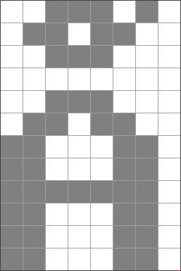
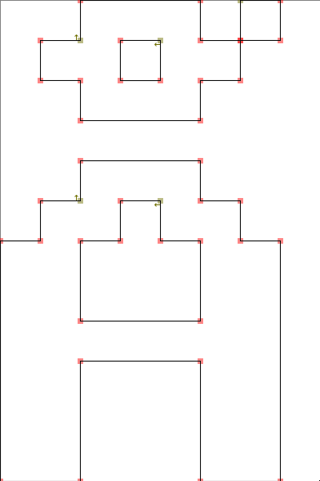

# pixpath
Transforms any font into pixel perfect outlines

This was written in C, Github shows Python only because the program generates a Python file that uses fontforge, see `test.py` which was generated from `font.otb`.

There are some hardcode values in main, those have to be adjusted for the specific use case.

This only works for X11 but the main code is OS independent (`src/path.c`)

Here is a preview that shows conversion from a bitmap glyph to a "svg" glyph.

